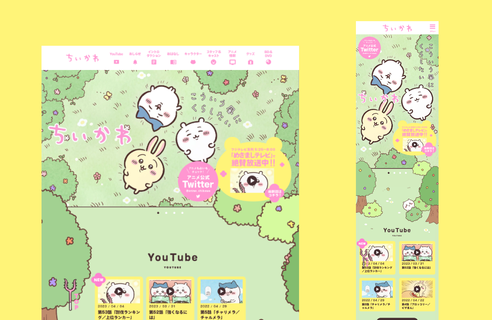

# Chiikawa Clone

This is a clone of the [Chiikawa home page](https://www.anime-chiikawa.jp/) made with HTML, CSS and JavaScript.

View the live site [here](https://moonlit-truffle-b5af95.netlify.app/)

- I tried to create the slide in animation with [ScrollReveal](https://scrollrevealjs.org/), but it didn’t work for some reasons…

### What I learned

- some of the characters’ animations are created by moving the background image back and forth with CSS @keyframes, pretty cool!
- some of the elements’ z-index didn’t work, then I realixed that **a child element is limited to the stacking context of its parent** thanks to **[this article](https://coder-coder.com/z-index-isnt-working/).** I fixed the problem by removing z-index property from the parent.